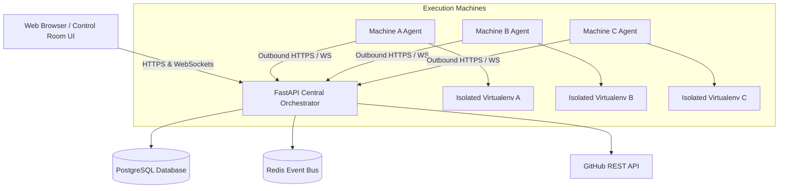

# System Architecture: Python GitHub Orchestrator

## High-Level Architecture Diagram

---

## Core Architectural Principles

1. **GitHub is the Source of Truth**:
   - Central Orchestrator dynamically discovers repositories, branches, commits, and Python entry points via the GitHub REST API.
   - Every job stores the exact resolved commit SHA for guaranteed deterministic reproduction.

2. **Zero-Runner Reliance**:
   - Execution runs completely independently of GitHub Actions.
   - Applications execute on private, registered Windows or Linux worker machines via custom lightweight Python Machine Agents.

3. **Complete Environment Isolation**:
   - Application dependencies are never installed globally on the host machine.
   - Each job creates a dedicated Python virtual environment (`venv`) under `C:\PythonOrchestrator\environments\JOB-XXXXX` and workspace under `C:\PythonOrchestrator\jobs\JOB-XXXXX`.

4. **Outbound-Only Worker Communication**:
   - Machine Agents only make outbound connections to the Central Orchestrator over HTTPS and WebSockets.
   - No inbound firewall ports or public IP addresses are required on worker nodes.

5. **Real-Time Streaming & Observability**:
   - The Machine Agent streams stdout and stderr concurrently line-by-line to the Central Orchestrator.
   - Control Room WebSockets broadcast output to connected UI terminals with sub-second latency.

---

## Component Breakdown

| Component | Responsibility | Technology Stack |
| :--- | :--- | :--- |
| **Central Backend** | REST APIs, WebSockets, Auth, Job Queueing, Scheduler, Machine Registry | FastAPI, SQLAlchemy 2.0, APScheduler, Pydantic, Python 3.12+ |
| **Control Room UI** | Enterprise RPA Dashboard, Machine Metrics, File Explorer, Terminal Console | React 18, TypeScript, Vite, Tailwind CSS, Lucide Icons |
| **Machine Agent** | Polling, Git clone/checkout, venv creation, pip install, process execution, streaming | Python 3.10+, psutil, httpx, subprocess, venv |
| **Storage & Bus** | Persistent entities, execution logs, distributed events | PostgreSQL 16, Redis 7 (or SQLite in local dev) |
