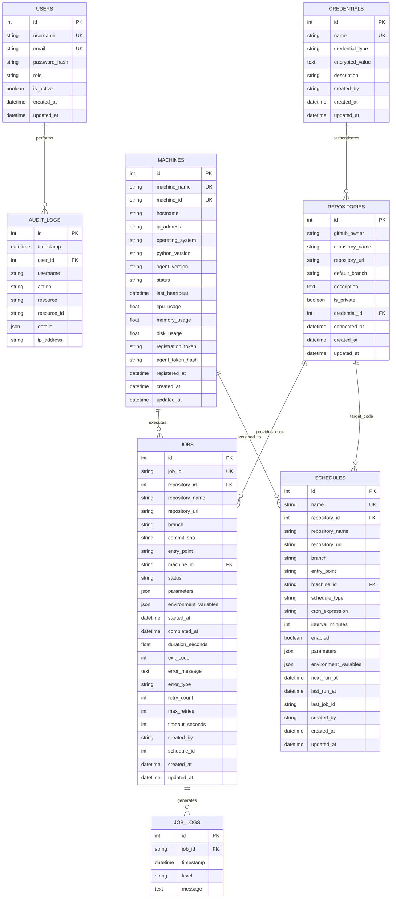

# Database Schema & Entity Relationship

The Central Orchestrator utilizes PostgreSQL for relational entity management and time-indexed job logging.

---

## Entity Relationship Diagram

---

## Status Enumerations

### Machine Status
- `ONLINE`: Agent beaconing within heartbeat window and available for execution.
- `BUSY`: Agent currently running an active job.
- `OFFLINE`: Heartbeat timed out (> 45 seconds).
- `DISABLED`: Manually disabled by operator/admin.

### Job Status
- `QUEUED`: Job created in Control Room, awaiting machine poll.
- `ASSIGNED`: Dispatched to target machine agent.
- `PREPARING`: Workspace setup and Git checkout in progress.
- `INSTALLING_DEPENDENCIES`: Virtual environment creation and pip install in progress.
- `RUNNING`: Python subprocess executing.
- `SUCCESS`: Process completed with exit code 0.
- `FAILED`: Process completed with non-zero exit code or error.
- `CANCELLED`: Execution manually stopped by operator.
- `TIMEOUT`: Execution exceeded configured timeout duration.
